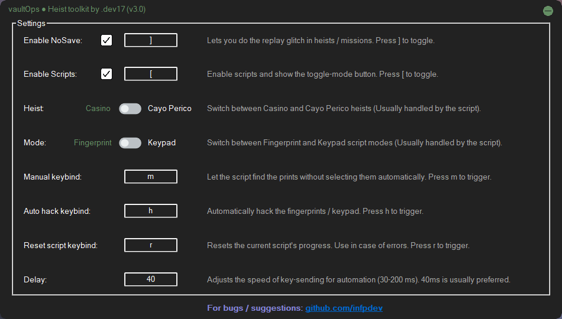

# VaultOps Toolkit

> "Because remembering fingerprints was more annoying than writing a script xd"

*An upgraded version of the standalone script **"GTA Casino Solver v2"**.
A local automation tool for GTA Online heist puzzles, built with AutoHotkey v2.0. Runs entirely locally, no data is sent anywhere.


<br>
<p align="center"><b>Watch tutorial</b><p>
<p align="center">
  <a href="https://youtu.be/j44mYY3tC10">
    
  </a>
</p>


## Contents
- [VaultOps Toolkit](#vaultops-toolkit)
  - [Contents](#contents)
  - [Features](#features)
  - [What This Script Is (and Isn't)](#what-this-script-is-and-isnt)
  - [Requirements](#requirements)
  - [⚠️ Disclaimer](#️-disclaimer)
  - [Quick Start](#quick-start)
    - [Plug and Play (TL;DR)](#plug-and-play-tldr)
  - [Detailed Toolkit Usage](#detailed-toolkit-usage)
    - [NoSave](#nosave)
    - [Fingerprint / Keypad solvers](#fingerprint--keypad-solvers)
    - [Hotkeys \& Controls](#hotkeys--controls)
    - [Options](#options)
  - [Standalone Solvers](#standalone-solvers)
  - [Building from Source](#building-from-source)
  - [Architecture](#architecture)
    - [Key Components](#key-components)
  - [License \& Attribution](#license--attribution)
  - [Support the project ᓚᘏᗢ](#support-the-project-ᓚᘏᗢ)
  - [TODO](#todo)

## Features

- Auto-solves **Diamond Casino Fingerprint** and **Keypad** puzzles  
- Auto-solves the **Cayo Perico Fingerprint Cloner** puzzle  
- Cayo Perico **PgUp** bug fix  
- **NoSave** — replay heist support  
- Manual and auto solving modes  
- GUI app with labels (tooltips) and customizable hotkeys — designed for non-technical users  

## What This Script Is (and Isn't)

<details>
<summary>Is this a mod?</summary>

No — it's not a mod, neither does it modify the game or its files. It's simply an AHK script with a GUI.
</details>

<details>
<summary>Does it inject or access game memory?</summary>

No — it does not inject DLLs, modify memory, hook into the game process, or require disabling anti-cheat.
</details>

<details>
<summary>How does it work then?</summary>

It runs externally using AutoHotkey:
- Reads pixels from the screen (to detect puzzles)  
- Sends keyboard and mouse inputs (to automate interactions)  
</details>

<details>
<summary>Is this safe to use? Will I get banned?</summary>

The solvers (fingerprint/keypad) function like input automation and are generally lower risk when used normally.  
However, the **NoSave** feature involves exploiting game behavior — excessive or repeated use can increase the risk of account action.
</details>

<details>
<summary>So what should I keep in mind?</summary>

Use responsibly, and avoid overexploiting the **(NoSave)** replay glitch.
</details>

Everything runs externally, similar to a macro tool, with a GUI for ease of use.


## Requirements

- **Windows** (tested on Windows 11) 
- **GTA Online** — tested on E&E, *may* work on Legacy
- The game should be in **Borderless Fullscreen**, OR **Borderless Windowed** at maximum in-game resolution (matching your screen resolution).
- **Supported screen resolution** (16:9)
  - The tool relies on fixed UI detection and only works when your screen resolution is one of the supported resolutions below.
  - **Currently supports:**
    - 1920×1080
    - 1600×900
    - 1366×768
- **Internet connection**  
  - Used only for update checks  
  - No data is collected or sent externally  
  - You can review the update-check logic in the source code  
- **Firewall enabled** *(optional)*  
  - Needed for NoSave functionality  
  - The app will attempt to enable it automatically if needed 


## ⚠️ Disclaimer

This is a hobby project built while learning AutoHotkey.

Use responsibly, and keep in mind that some features may not align with Rockstar Games’ Terms of Service. You’re responsible for how you use it.

Provided as-is, with no guarantees.

## Quick Start
No setup required — just run and use.


> 🔍 VirusTotal scan (for transparency):  
> https://www.virustotal.com/gui/file/c60561df4f09f015dd46f6065b20ba5526bdbb7eda25d7b26c566bc9103696d5


<p align="center">
  
</p>

### Plug and Play (TL;DR)

1. Downlaod and run the setup [vaultOps-Setup.exe](https://github.com/infpdev/gtao-heist-toolkit/releases/latest/download/vaultOps-Setup.exe) to extract the contents
2. Launch `vaultOps.exe`  
3. Click **Enable Scripts**  
4. Start a heist puzzle → the tool will detect it automatically → marks the prints for Casino hacks and auto-solves in case of  Cayo Perico fingerprints.

(Optional)  
- Press **Auto** `H` to solve instantly  
- Or stay in **Manual** `M` to select prints yourself  


## Detailed Toolkit Usage
### NoSave

- Allows you to replay the heist by preventing the game from saving  

**How to use:**
1. Enable **NoSave** either from the app, or using the hotkey, which is `]` by default, during the heist  
2. Make sure it is active **before the payment cutscene**  
3. After returning to freeroam, switch to **Story Mode** while keeping NoSave enabled  
4. Once Story Mode loads, disable **NoSave**  
5. Return to GTA Online — the heist can be replayed without setups  

**Behavior:**
- Works by temporarily blocking network communication  
- Requires firewall to be enabled  

**Notes:**
- The app will attempt to enable the firewall automatically if needed  
- To verify it’s active, press `Alt + F4`. If you see a **“save failed”** message, it’s working.


### Fingerprint / Keypad solvers
1. **Enable Scripts**
   - Activates the solvers  
   - Automatically detects puzzles and switches modes  

   **Behavior:**
   - May occasionally misdetect normal scenes as puzzles  
   - This can cause the label to switch modes unnecessarily  

   **Recommendation:**
   - Enable only when solving puzzles  
   - Or use **Manual mode** to prevent auto switching  
   - Assign a hotkey for quick toggling <br><br>

2. **Select Heist**
   - **Casino**
     - Solves Fingerprint and Keypad puzzles  
   - **Cayo Perico**
     - Solves the fingerprint cloner puzzle  
     - Enables PgUp forwarding for plasma cutter  
     - Default PgUp key: **Left Mouse Button** `LMB`  
     - Can be changed to any key (e.g., `Enter`)  

      **Note:** When using the PgUp feature, prefer **Manual mode** to avoid unwanted auto-switching <br><br>

3. **Choose Mode (Casino only)**
   - **Fingerprint** — Detects and solves the fingerprint puzzle  
   - **Keypad** — Solves the keypad puzzle  

      **Note:**  Switching to **Manual mode** disables auto-detection, preventing unintended mode changes  


### Hotkeys & Controls

All hotkeys are customizable.

- **Enable Scripts** `[`
  - Enables / disables automation  
  - Recommended: Disable when not solving puzzles  

- **NoSave** `]`
  - Temporarily blocks saving to replay the heist  
  - Requires firewall to be enabled  
  - The app attempts to enable firewall automatically  

- **Manual** `M`
  - Detects patterns without selecting them  
  - Useful when you want full control  
  - Prevents incorrect auto switching  

- **Auto Hack** `H`
  - Automatically solves detected puzzles  
  - Can be enabled before starting for smoother flow  

- **Reset** `R`
  - Stops current solving and resets state  
  - Sets solver to **(idle)** and re-enables auto detection  
  - Use if detection behaves incorrectly  

- **Send PgUp** `[LMB]` (Cayo Perico only)
  - Allows plasma cutter usage  
  - Forwards another key as PgUp  
  - Default: **Left Mouse Button (LMB)**  
  - Fully customizable  


### Options

- **Delay** (30–200 ms)
  - Controls auto-mode solving speed  
  - Lower = faster (may be unstable)  
  - Higher = slower (more stable)  
  - Default: **40 ms** (Recommended)


## Standalone Solvers

Don't want the full toolkit? Use any of these standalone SFX packages to run individual solvers:
> Note: Each of these standalone solvers include the **NoSave** script, so you need not download the NoSave standalone script if you download any of the three solvers.

- **[Casino Fingerprint Solver](https://github.com/infpdev/gtao-heist-toolkit/releases/latest/download/Fingerprint-Standalone-SFX.exe)** — Standalone solver for the casino fingerprint scanner
- **[Casino Keypad Solver](https://github.com/infpdev/gtao-heist-toolkit/releases/latest/download/Keypad-Standalone-SFX.exe)** — Standalone solver for the casino keypad cracker
- **[Cayo Perico El Rubio Solver](https://github.com/infpdev/gtao-heist-toolkit/releases/latest/download/ElRubio-Standalone-SFX.exe)** — Standalone solver for cayo perico fingerprint puzzle
- **[NoSave Standalone](https://github.com/infpdev/gtao-heist-toolkit/releases/latest/download/NoSave-Standalone.exe)** — NoSave replay glitch tool only

**Installation:**
1. Download any SFX package
2. Run the `.exe` — it will auto-extract to the current directory
3. Launch the extracted `.exe` to use that solver independently

Each standalone includes all necessary resources (UI templates, detection logic) and can be used without the main toolkit.


## Building from Source

Want to verify the source code or build the executable yourself? See [BUILD.md](_src/lib/build_scripts/BUILD.md) for complete build instructions, prerequisites, and configuration options.


## Architecture

```
_src/
│
├─ 1920x1080/, 1600x900/, 1366x768/   # Resolution-specific images for the solver 
├─ vaultOps.ahk                       # Entry point (main GUI + mode control)
├─ zSettings.ini                      # User configuration (hotkeys, delay, etc.)
├─ zAnchorCache.ini                   # Cached anchor coordinates for solvers
│
├─ lib/
│  ├─ build_scripts/
│  │  ├─ dist.ahk                     # Build distribution (compile + package)
│  │  ├─ virusTotalScan.ahk           # Post-build VirusTotal scanning
│  │  └─ inno_setup.iss               # Inno Setup installer config
│  │
│  ├─ gui/
│  │  ├─ windowHelpers.ahk            # Window focus + activation handling
│  │  ├─ hotkeyHelpers.ahk            # Hotkey event callbacks
│  │  ├─ tooltipsHelpers.ahk          # Status tooltip updates
│  │  └─ instructionFieldHelpers.ahk  # GUI field text management
│  │
│  ├─ scripts/
│  │  ├─ CasinoFingerprint.ahk        # Casino fingerprint detection + solving
│  │  ├─ CasinoKeypad.ahk             # Casino keypad sequence solving
│  │  ├─ ElRubio.ahk                  # Cayo Perico multi-stage fingerprint
│  │  └─ NoSave.ahk                   # Handles NoSave usage
│  │
│  ├─ standalone scripts/             # Pre-built standalone solver executables
│  │
│  ├─ initHotkeys.ahk                 # Hotkey registration + event binding
│  ├─ updateCheck.ahk                 # Version checking
│  └─ commonFuncs.ahk                 # Shared utilities for the Toolkit and Standalone scripts
│
└─ README.md                          # Documentation (this file)
```

### Key Components

**Entry Point:**
- `vaultOps.ahk` — GUI initialization, mode selection, hotkey binding, solver lifecycle

**Core Utilities:**
- `initHotkeys.ahk` — Registers all hotkey bindings and attaches event handlers; runs on startup
- `updateCheck.ahk` — Checks for newer releases; handles version comparison and user notifications
- `commonFuncs.ahk` — Shared helpers: centered tooltips, click-through tooltip styling, hotkey display formatting

**Solvers** (independent classes):
- `CasinoFingerprint` — Pattern recognition with manual/auto modes
- `CasinoKeypad` — Sequence detection and solving
- `ElRubio` — Multi-stage fingerprint cloner puzzle (Cayo Perico)

**Build System:**
- `dist.ahk` — Orchestrates compilation, packaging, and deployment
- `virusTotalScan.ahk` — Optional post-build security scanning

**GUI Helpers:**
- Modular utilities for window management, tooltips, and UI field handling

Each solver operates independently with its own detection logic, state handling, and reset behavior. Solvers are instantiated on mode change and destroyed on exit to avoid conflicts.


## License & Attribution

This project builds upon existing ideas and implementations in the community:

- **NoSave:** Based on the replay method described in  
  https://www.reddit.com/r/gtaglitches/comments/okz5lg/exploit_pc_v1_nosavingsaveblock_method_ahk_replay/

- **Fingerprint / Keypad detection:** Inspired by  
  https://github.com/gbs0/gta_casino_solver

This project extends those implementations with:
- Automatic solving algorithms  
- Multi-heist support  
- Custom GUI and usability improvements  

Shared for educational and personal use.

## Support the project ᓚᘏᗢ

while this project does not require funding, if you find it useful, consider feeding my car (or a stray car) some tuna.

i’ll make sure to pet the car for you, and also post a picture of the car with your tag below it :]

[](https://github.com/sponsors/infpdev)

here's a car for reading this far **C:**

```text

⠀⠀⠀⠀⣠⣤⣀⠀⠀⠀⠀⠀⠀⠀⠀⠀⠀⠀⠀⠀⠀⠀⠀⠀⠀⠀⠀⠀
⠀⠀⠀⢰⣿⠀⠉⠙⢲⢄⡀⠀⠀⠀⠀⠀⠀⠀⣀⡀⠀⠀⠀⠀⠀⠀⠀⠀
⠀⠀⠀⢸⠈⠀⠀⠀⠀⠈⠘⠋⠉⠉⠉⠛⢓⣾⢋⠽⣷⣀⡀⠀⠀⠀⠀⠀
⠀⠀⠀⢸⠀⢀⡄⠀⠀⠀⠀⠀⠀⠐⣶⡲⣾⠏⡜⣤⣿⣏⠁⠀⠀⠒⠒⡂
⠀⠀⠀⠈⡶⠃⠀⠀⠀⠀⠀⠀⠀⠀⠘⣿⣧⣙⡔⣳⡿⣭⡷⢤⣤⣀⣸⠋
⠀⠀⢀⡼⠁⠀⠀⠀⠀⠀⠀⠀⠀⠀⢸⣷⣽⡿⠿⠛⢿⣿⢙⠣⡆⣽⣿⠀
⢀⣤⠞⠀⠀⠀⠀⠀⠀⠀⠀⠀⠀⠀⠀⠀⠀⠀⠀⠀⠈⣿⣎⣵⣾⣿⣧⠀
⠉⢿⡖⠤⠀⠀⣰⣧⡄⠀⠀⠀⠀⠀⠀⠀⠀⠀⠀⠀⠀⢻⣿⡿⣷⡚⠛⠀
⠒⠘⢾⣲⠀⠀⠛⠋⠁⠀⠀⠀⠀⠀⠀⠀⠀⣴⣦⡄⠀⠀⠋⠁⣻⣷⣄⠀
⠀⠄⠚⠫⣂⠀⠀⠀⠀⠀⢠⣶⣶⠄⠀⠀⠐⢿⠿⠁⠀⢀⠖⡖⣯⣿⣟⡀
⠀⠀⠀⠀⠈⠓⠤⣀⡀⠀⠀⠈⠀⠀⠀⠀⠀⠀⠀⠀⠀⣌⢙⡲⣿⡇⠀⠁
⠀⠀⠀⠀⠀⠀⠀⢀⡽⢻⣖⠲⠤⣤⣤⣤⣤⣤⣶⠾⠓⠊⢫⠀⠈⠁⠀⠀
⠀⠀⠀⠀⠀⠀⠐⢻⣿⠧⣾⣯⠙⠉⠁⠀⠀⠀⠈⠳⣄⠀⠀⠁⠀⠀⠀⠀
⠀⠀⠀⠀⠀⠀⠀⠈⢿⡇⡼⣗⡞⠀⠀⠀⣦⠀⠀⠀⠀⠙⢦⠀⠀⢠⢷⠀
⠀⠀⠀⠀⠀⠀⠀⠀⡞⠙⢧⠞⠀⠀⠀⢠⡿⠀⠀⠀⠀⠀⠈⣧⠚⠁⣸⠀
⠀⠀⠀⠀⠀⠀⠀⠰⡇⢀⠞⠀⠀⠀⠀⣼⠃⠀⠀⠀⠀⠀⠔⡿⠀⡠⡻⠀
⠀⠀⠀⠀⠀⠀⠀⠀⢧⡞⠀⠀⠀⠀⡰⠋⠓⠦⣄⡀⠀⣀⡴⠧⠤⠚⠁⠀
⠀⠀⠀⠀⠀⠀⠀⠀⠀⠙⠲⠴⠶⠚⠓⠒⠒⠉⠉⡉⠉⢁⠀⣀⡀⠀⠀⠀
```

## TODO
- [x] Add file-based caching for the solvers to improve performance and reduce redundant processing - [v3.2](https://github.com/infpdev/gtao-heist-toolkit/releases/tag/v3.2)