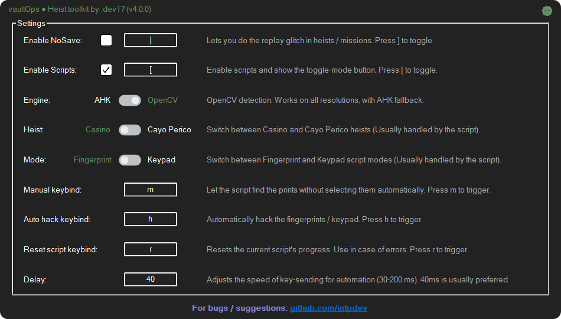

# VaultOps ● GTA Online Heist Toolkit

[](https://github.com/infpdev/gtao-heist-toolkit/releases/latest) [](https://github.com/infpdev/gtao-heist-toolkit/releases/latest) [](https://github.com/sponsors/infpdev)

> "Because remembering fingerprints was more annoying than writing a script xd"

> A local automation tool for GTA Online heist puzzles, built with AutoHotkey v2<br>
> An upgraded version of the standalone script **"GTA Casino Solver v2"**<br>
> Now supports all 16:9 and ultrawide (21:9) monitors through the OpenCV detection engine


<br>
<p align="center"><b>Video Tutorials</b></p>

<p align="center">
  <a href="https://youtu.be/j44mYY3tC10">
    
  </a>
</p>

<p align="center">
  <a href="https://youtu.be/Cd5V64UiiGY">
    Cayo Perico Replay Guide
  </a>
  <br>
  <a href="https://youtu.be/fBdukmCSDeA">
    Diamond Casino Replay Guide
  </a>
  <br>
  <a href="https://youtu.be/2f2PhGMIApw">
    Kortz Center Puzzle Solvers + Replay Guide
  </a>
  <br><br>
  <a href="https://youtu.be/hupQ7fMXHTE">
    Buffered Ledge Grab automation for Diamond Casino
  </a>

</p>

## Overview

This repository includes:

* **[VaultOps](#plug-and-play-tldr)**: Main all-in-one toolkit with GUI support, multi-heist automation, and both AHK/OpenCV detection engines
* **[Standalone Scripts](#standalone-scripts)**: Independent puzzle solvers for specific heists (Fingerprint, Keypad, etc.)
* **[NoSave Replay Script](#standalone-scripts)**: Standalone replay script without the full toolkit
* **[AFK Key Holder](https://github.com/infpdev/gtao-heist-toolkit/releases/tag/utilities)**: Holds or periodically sends a selected key to avoid AFK kicks during jobs, races, freeroam activities, or other long idle sessions in GTA Online
* **[Public to Solo Session Helper](https://github.com/infpdev/gtao-heist-toolkit/releases/tag/utilities)**: Forces GTA Online to disconnect from the current session host, causing the lobby to be converted into a solo public session. Useful for heist preps, sell missions, and other activities without other players interfering.
* **[Triggerbot](https://github.com/infpdev/gtao-heist-toolkit/releases/tag/utilities)**: Automatically fires when the crosshair turns red. Useful for quickly and accurately shooting NPCs such as police officers, helicopter pilots, and mission enemies during heists, freemode, and other PvE activities.


## Contents
- [VaultOps ● GTA Online Heist Toolkit](#vaultops--gta-online-heist-toolkit)
  - [Overview](#overview)
  - [Contents](#contents)
  - [Features](#features)
  - [What This Script Is (and Isn't)](#what-this-script-is-and-isnt)
  - [Requirements](#requirements)
  - [⚠️ Disclaimer](#️-disclaimer)
  - [Quick Start](#quick-start)
    - [Plug and Play (TL;DR)](#plug-and-play-tldr)
  - [Detailed Toolkit Usage](#detailed-toolkit-usage)
    - [NoSave](#nosave)
    - [Ledge Grab Automation](#ledge-grab-automation)
    - [Fingerprint / Keypad solvers](#fingerprint--keypad-solvers)
    - [Hotkeys \& Controls](#hotkeys--controls)
    - [Options](#options)
  - [Standalone Scripts](#standalone-scripts)
  - [Run Locally](#run-locally)
  - [Architecture](#architecture)
    - [Key Components](#key-components)
  - [License \& Attribution](#license--attribution)
  - [Support the project ᓚᘏᗢ](#support-the-project-ᓚᘏᗢ)
  - [TODO](#todo)

## Features

- Auto-solves **Fingerprint** and **Keypad** puzzles in the **Diamond Casino** and **Kortz Center** heists
- Auto-solves the **Cayo Perico Fingerprint Cloner** puzzle  
- Automates the **Buffered Ledge Grab** glitch, primarily used in the Diamond Casino heist
- Supports both **AHK-based** and **OpenCV-based** detection methods  
- Supports all common **16:9** and **21:9 ultrawide** resolutions  
- Cayo Perico **PgUp** bug fix  
- Enhanced **NoSave** — Automatically enables the firewall when needed and disables NoSave on exit  
- Manual and auto solving modes  
- GUI app with labels/tooltips and customizable hotkeys — designed for non-technical users  

## What This Script Is (and Isn't)

<details>
<summary>Is this a mod?</summary>

No — it is not a mod, nor does it modify the game or its files.  
It is simply an external AHK-based tool with a GUI.
</details>

<details>
<summary>Does it inject or access game memory?</summary>

No — it does not inject DLLs, modify memory, hook into the game process, or require disabling anti-cheat.
</details>

<details>
<summary>How does it work then?</summary>

It runs externally using AutoHotkey and OpenCV:

- Reads pixels from the screen (to detect puzzles)  
- Sends keyboard and mouse inputs (to automate interactions)  
</details>

<details>
<summary>Is this safe to use? Will I get banned?</summary>

The puzzle solvers (fingerprint/keypad) function similarly to input automation and are generally lower risk when used normally.  

However, the **NoSave** feature involves exploiting game behavior — excessive or repeated abuse may increase the risk of account action.
</details>

<details>
<summary>So what should I keep in mind?</summary>

Use responsibly, and avoid overusing the **NoSave** replay glitch.
</details>

Everything runs externally, similar to a macro tool, with a GUI designed for ease of use.


## Requirements

- **Windows** (tested on Windows 11)  
- **GTA Online** — tested and supported on both **Enhanced** and **Legacy**
- **60 FPS** or more *(required only for Buffered Ledge Grab Automation)*
- The game should be running in **Borderless Fullscreen** or **Borderless Windowed** mode  
- **Supported resolutions**
  - Supports all common **16:9** and **21:9 ultrawide** resolutions
- **Internet connection** *(optional)*  
  - Used only for update checks  
  - No data is collected or sent externally  
  - The update-check logic is fully visible in the source code  
- **Firewall enabled** *(optional)*  
  - Required for the NoSave feature  
  - The toolkit can automatically enable it when needed  
- **Administrator privileges**
  - Required for NoSave, firewall management and auto-updates.


## ⚠️ Disclaimer

This is a hobby project built while learning AutoHotkey.

Use responsibly, and keep in mind that some features may not align with Rockstar Games’ Terms of Service. You’re responsible for how you use it.

Provided as-is, with no guarantees.

## Quick Start

> 🔍 VirusTotal scan (for transparency only. AutoHotkey automation tools are commonly flagged by heuristic engines):
> https://www.virustotal.com/gui/file/38f4d03292e2fadc86362ad0739976b706c9e534e65073cdde3e4f127abb60a4


<p align="center">
  
</p>

### Plug and Play (TL;DR)

1. Download and run the setup [vaultOps-Setup.exe](https://github.com/infpdev/gtao-heist-toolkit/releases/latest/download/vaultOps-Setup.exe) to extract the contents
2. Launch `vaultOps.exe`  
3. Click **Enable Scripts**  
4. Start a heist puzzle → the tool will detect it automatically → marks the prints for Diamond Casino and Kortz Center hacks, and auto-solves in case of Cayo Perico fingerprints.

**Optional:**
- Press **Auto** `H` to solve instantly
- Or stay in **Manual** `M` to select prints yourself

> [!NOTE]
> - vaultOps runs in the system tray. Left-click the tray icon to terminate it immediately, or right-click → **Exit** to close it. <br>
> - Windows may display a warning when launching the setup. This is because the setup is not code-signed, which can cause Windows SmartScreen to treat it as an unrecognized application.<br> If this happens, click **More info** and then **run anyway** to continue the installation. Don't worry, it's safe and you won't harm your computer \:]
>
> <p align="center">
> 
> 
> </p>

## Detailed Toolkit Usage
### NoSave

- Allows you to replay the heist by preventing the game from saving  

**How to use:**
1. Enable **NoSave** either from the app, or using the hotkey, which is `]` by default, during the heist  
2. Make sure it is active **before the payment cutscene**  
3. After returning to freeroam, switch to **Story Mode** while keeping NoSave enabled  
4. Once Story Mode loads, disable **NoSave**  
5. Return to **GTA Online**.
6. Force a save by pressing **Alt + F4**, then press **ESC** to cancel the quit prompt.
7. Switch to **Story Mode**, then return to **GTA Online** (without NoSave enabled). The heist can now be replayed without setups.

> [!WARNING]
> Failing to switch to **Story Mode** the second time may cause you to lose your saved heist. Make sure to follow the steps carefully.

**Behavior:**
- Works by temporarily blocking network communication  
- Requires firewall to be enabled  

> [!NOTE]
> - The app will attempt to enable the firewall automatically if it's not enabled.
> - VaultOps may warn you if third-party antivirus/firewall software appears to be interfering with NoSave.
> - The app will automatically disable NoSave on exit to prevent leaving the firewall in a blocked state.
> - To verify it’s active, press `Alt + F4`. If you see a **"save failed"** message, it’s working.

> [!TIP]
> Full replay tutorials:
> - Cayo Perico: https://youtu.be/Cd5V64UiiGY
> - Diamond Casino: https://youtu.be/fBdukmCSDeA
> - Kortz Center: https://youtu.be/2f2PhGMIApw

### Ledge Grab Automation

* Automates the **Buffered Ledge Grab** glitch, primarily used in the Diamond Casino heist, eliminating the need to time the inputs manually.

**How to use:**

1. Enable **Ledge Grab** in the GUI app. (There is no hotkey to toggle this option.)
2. Position your character near the ledge so that it is facing the ledge and ready to take cover.
3. Press the **Take Cover** key (`Q` by default) to start the automation.
4. Wait for the script to perform the ledge grab sequence. Keyboard and mouse input will be temporarily blocked during this time.
5. Once you see the **"Input re-enabled"** tooltip, move to the desired position.
6. Press the **Take Cover** key again to stop the automation.

> [!NOTE]
>
> * If your in-game **Take Cover** keybind is not `Q`, change it in the GUI app, or the in-game controls, before using the feature.
> * Do not close the phone until you are teleported to the ledge, otherwise the glitch will simply fail.
> * This feature is primarily intended for the Diamond Casino heist, since the glitch is not useful for looting in the Cayo Perico heist.
> * You will **not** be able to use the **ledge grab** feature while vaultOps is in **Manual** or **Auto** mode, and the **puzzle solvers** will be **unavailable** while the **ledge grab automation** is active.
> * Full tutorial: https://youtu.be/hupQ7fMXHTE


### Fingerprint / Keypad solvers

1. **Enable Scripts**
   - Activates the puzzle solvers  
   - Automatically detects puzzles and switches modes when possible  

   **Behavior:**
   - Auto-detection may occasionally misdetect normal scenes as puzzles  
   - This can cause the label or selected mode to switch unexpectedly  

   **Recommendation:**
   - Enable only when solving puzzles  
   - Or use **Manual mode** to prevent automatic switching  
   - Assign a hotkey for quick toggling  <br><br>

2. **Detection Engine**
   - **AHK**
     - Legacy pixel-based detection  
     - Fast and battle-tested  
     - Available only on supported lower 16:9 resolutions  

   - **OpenCV**
     - More flexible image-based detection  
     - Recommended for higher resolutions and ultrawide displays
     - Automatically selected on unsupported resolutions/aspect ratios
     - Higher resolutions and 21:9 setups will use OpenCV automatically  <br><br>

3. **Select Heist**
   - **Diamond Casino / Kortz Center**
     - Shown as "**DC / Kortz**" in the GUI
     - Solves Fingerprint and Keypad puzzles
     - Both heists use the same Fingerprint and Keypad puzzles, so the same solver (**DC / Kortz**) works for either heist

   - **Cayo Perico**
     - Solves the fingerprint cloner puzzle  
     - Enables PgUp forwarding for the plasma cutter  
     - Default PgUp key: **Left Mouse Button** `LMB`  
     - Can be changed to another key (e.g. `Enter`)  

   **Note:** When using the PgUp feature, Manual mode is generally recommended to avoid unintended auto-switching  <br><br>

4. **Choose Mode (Diamond Casino / Kortz Center only)**
   - **Fingerprint** — Detects and solves the fingerprint puzzle  
   - **Keypad** — Detects and solves the keypad puzzle  

   **Note:** Switching to **Manual mode** disables automatic puzzle detection, preventing unintended mode changes  


### Hotkeys & Controls

All hotkeys are customizable.

| Action | Default | Description | Notes |
|---|---|---|---|
| Enable Scripts | `[` | Enables / disables automation | Recommended: disable when not solving puzzles |
| NoSave | `]` | Temporarily blocks saving the progress to replay the heist | Requires Windows Firewall to be enabled |
| Manual | `M` | Detects patterns without selecting them | Useful for full manual control |
| Auto Hack | `H` | Automatically solves detected puzzles | Can be enabled before starting for smoother flow |
| Reset | `R` | Stops current solving and resets state | Re-enables auto detection and sets solver to `(idle)` |
| Send PgUp *(Cayo Perico only)* | `LMB` | Forwards another key as `PgUp` | Default: Left Mouse Button (`LMB`) |


### Options

| Option | Description | Notes |
|---|---|---|
| Delay (30 – 200 ms) | Controls auto-mode solving speed | Lower = faster but unstable<br>Higher = slower but stable<br>Recommended / Default: `40 ms` |
| Tooltip Position | Chooses where status tooltips appear on the screen | Supports six screen positions. Default: `Top-Right` (`ToolTipPos=4`). Can currently be changed only in `zSettings.ini`. |
| Tooltip Y Offset | Adjusts the vertical position of status tooltips | Useful for avoiding overlap with in-game HUD elements or display burn-in. Can currently be changed only in `zSettings.ini`. |

## Standalone Scripts

Don't want the full toolkit? Use the standalone package instead.

The standalone package includes:
- Fingerprint Solver for Diamond Casino / Kortz Center
- Keypad Solver for Diamond Casino / Kortz Center
- Cayo Perico Fingerprint Solver

All standalone solvers share a single OpenCV engine and common resources to reduce package size and avoid duplicated files.

- **[vaultOps-Standalone-Pack.exe](https://github.com/infpdev/gtao-heist-toolkit/releases/latest/download/vaultOps-Standalone-Pack.exe)** — Includes all standalone puzzle solvers in a single package
- **[NoSave-Standalone.exe](https://github.com/infpdev/gtao-heist-toolkit/releases/latest/download/NoSave-Standalone.exe)** — Standalone NoSave replay script only
- **[AFK-Key-Holder](https://github.com/infpdev/gtao-heist-toolkit/releases/tag/utilities)** — Holds or periodically sends a selected key to avoid AFK kicks during jobs, races, freeroam activities, or other long idle sessions in GTA Online
- **[Solo Session Helper](https://github.com/infpdev/gtao-heist-toolkit/releases/tag/utilities)** — Forces GTA Online to disconnect from the current session host, causing the lobby to be converted into a solo public session. Useful for heist preps, sell missions, and other activities without other players interfering.
- **[Triggerbot](https://github.com/infpdev/gtao-heist-toolkit/releases/tag/utilities)** — Automatically fires when the crosshair turns red. Useful for quickly and accurately shooting NPCs such as police officers, helicopter pilots, and mission enemies during heists, freemode, and other PvE activities.

**Installation:** (vaultOps Standalone Pack)
1. Download and run `vaultOps-Standalone-Pack.exe`
2. The package will automatically extract into a folder named `vaultOps-Standalone-Pack` in the current directory
3. Launch any standalone solver separately as needed

> [!NOTE]
> * The standalone pack already includes built-in **NoSave** support for all puzzle solvers, so the separate **NoSave** standalone is only needed if you want to use NoSave by itself.<br><br>
> * **NoSave** and the **Utility Scripts** are distributed as standalone executables and are not SFX packages. Simply download and run the `.exe` file to launch them.

> [!WARNING]
> * Running multiple standalone solvers at the same time is not recommended, since they share the same default hotkeys and may trigger actions simultaneously. <br><br>
> * If you want to use multiple solvers together, using the full VaultOps toolkit is recommended instead, since it manages all solvers within a single unified app.


## Run Locally

Want to run or modify the project locally? Follow these steps:

1. Clone the repository:
   `git clone https://github.com/infpdev/gtao-heist-toolkit.git`

2. Navigate to the project directory:
   `cd gtao-heist-toolkit`

3. Install the Python dependencies required for the OpenCV engine:
   `pip install -r ./lib/py_helpers/requirements.txt`

   This requires Python to be installed and added to your system PATH.

4. Launch `vaultOps.ahk` or any standalone script to run the project locally.


## Architecture

```
_src/
│
├─ 1920x1080/, 1600x900/, 1366x768/   # Legacy AHK template assets for supported 16:9 resolutions
│
├─ lib/
│  ├─ build_scripts/
│  │  ├─ dist.ahk                     # Build distribution (compile + package)
│  │  ├─ virusTotalScan.ahk           # Post-build VirusTotal scanning
│  │  └─ inno_setup.iss               # Inno Setup installer config
│  │
│  ├─ gui/
│  │  ├─ anchorDetection.ahk          # Anchor detection logic for AHK mode
│  │  ├─ hotkeyHelpers.ahk            # Hotkey event callbacks
│  │  ├─ instructionFieldHelpers.ahk  # GUI field text management
│  │  ├─ tooltipsHelpers.ahk          # Status tooltip updates
│  │  └─ windowHelpers.ahk            # Window focus + activation handling
│  │
│  ├─ py_helpers/                     # Python/OpenCV helpers
│  │  ├─ anchorDetection.py           # Anchor detection logic for OpenCV detection engine
│  │  ├─ Fingerprint.py               # Diamond Casino / Kortz fingerprint detection logic for OpenCV detection engine
│  │  ├─ Keypad.py                    # Diamond Casino / Kortz keypad detection logic for OpenCV detection engine
│  │  ├─ cayofingerprint.py           # Cayo Perico fingerprint detection logic for OpenCV detection engine
│  │  ├─ OpenCV_Engine.py             # OpenCV detection engine + IPC listener
│  │  └─ requirements.txt             # Python deps for OpenCV detection engine
│  │
│  ├─ scripts/
│  │  ├─ Fingerprint.ahk              # Diamond Casino / Kortz fingerprint detection + solving
│  │  ├─ Keypad.ahk                   # Diamond Casino / Kortz keypad sequence solving
│  │  ├─ ElRubio.ahk                  # Cayo Perico multi-stage fingerprint
│  │  └─ NoSave.ahk                   # Handles NoSave usage
│  │
│  ├─ standalone scripts/             # Individual scripts - Solvers and NoSave
│  │
│  ├─ utils/                          # Utility scripts (AFK Key Holder, Public to Solo Session Helper, Triggerbot)
│  │
│  ├─ ahk2py_socket.ahk               # AHK script for IPC communication with the OpenCV detection engine
│  ├─ autoUpdate.ahk                  # Auto-update helper for minor patch releases
│  ├─ checkResolution.ahk             # Resolution detection and fallback handling
│  ├─ commonFuncs.ahk                 # Shared utilities for the Toolkit and Standalone scripts
│  ├─ initHotkeys.ahk                 # Hotkey registration + event binding
│  ├─ pureCommonFuncs.ahk             # Shared utilities for the Toolkit and Standalone scripts (no global dependencies)
│  ├─ sharedCanonicalHelpers.ahk      # Canonical hotkey conversion helpers
│  ├─ standaloneHelpers.ahk           # Shared helpers for standalone builds
│  ├─ standaloneUpdate.ahk            # Auto-updater for standalone scripts
│  └─ updateCheck.ahk                 # Version checking
│
├─ vaultOps.ahk                       # Entry point (main GUI + mode control)
├─ zAnchorCache.ini                   # Cached anchor coordinates for solvers
├─ zSettings.ini                      # User configuration (hotkeys, delay, etc.)
│
└─ README.md                          # Documentation (this file)
```

### Key Components

**Entry Point**
- `vaultOps.ahk` — Main GUI, mode control, engine selection, and solver lifecycle

**Core Utilities**
- `autoUpdate.ahk` — Minor patch updater
- `checkResolution.ahk` — Resolution/aspect-ratio checks and engine availability
- `commonFuncs.ahk` — Shared helpers and tooltip utilities
- `initHotkeys.ahk` — Hotkey registration and callbacks
- `sharedCanonicalHelpers.ahk` — Canonical hotkey formatting/helpers
- `standaloneHelpers.ahk` — Shared helpers for standalone builds
- `pureCommonFuncs.ahk` — Shared utilities for the Toolkit and Standalone scripts (no global dependencies)
- `updateCheck.ahk` — Version checking and update notifications
- `standaloneUpdate.ahk` — Auto-updater for standalone scripts

**AHK Scripts**
- `Fingerprint.ahk` — Diamond Casino / Kortz fingerprint solver
- `Keypad.ahk` — Diamond Casino / Kortz keypad solver
- `ElRubio.ahk` — Cayo fingerprint cloner solver
- `NoSave.ahk` — NoSave handling and firewall automation
- `Util-AFK-Key-Holder.ahk` — AFK key holder with customizable hotkeys and on-screen instructions for AFK jobs
- `Util-Solo-Public-Session.ahk` — Public to solo session helper
- `Util-TB.ahk` — Triggerbot with customizable hotkeys and configurable pixels

**OpenCV Detection Engine (`lib/py_helpers/`)**
- `OpenCV_Engine.py` — IPC listener/backend entry point
- `anchorDetection.py` — Puzzle anchor detection
- `Fingerprint.py` — Diamond Casino / Kortz fingerprint detection
- `Keypad.py` — Diamond Casino / Kortz keypad detection
- `cayofingerprint.py` — Cayo fingerprint detection
- `requirements.txt` — Python dependencies for development mode

**Build System**
- `dist.ahk` — Build/package automation
- `virusTotalScan.ahk` — Optional VirusTotal scan helper
- `inno_setup.iss` — Inno Setup installer config

Each solver operates independently with its own detection logic, state handling, and reset behavior. Solvers are instantiated on mode change and destroyed on exit to avoid conflicts.


## License & Attribution

This project builds upon existing ideas and implementations in the community:

- **NoSave:** Based on the replay method described in  
  https://www.reddit.com/r/gtaglitches/comments/okz5lg/exploit_pc_v1_nosavingsaveblock_method_ahk_replay/

- **Fingerprint / Keypad detection:** Inspired by  
  https://github.com/gbs0/gta_casino_solver

- **OpenCV:** Inspired by VKit (https://github.com/ItsCEED/vkit-toolbox)

This project extends those implementations with:
- Automatic solving algorithms  
- Multi-heist support  
- Custom GUI and usability improvements  

Shared for educational and personal use.

## Support the project ᓚᘏᗢ

while this project does not require funding, if you find it useful, consider feeding my car (or a stray car) some tuna.

i’ll make sure to pet the car for you, and also post a picture of the car with your tag below it :]

[](https://github.com/sponsors/infpdev)

here's a car for reading this far **C:**

```text

⠀⠀⠀⠀⣠⣤⣀⠀⠀⠀⠀⠀⠀⠀⠀⠀⠀⠀⠀⠀⠀⠀⠀⠀⠀⠀⠀⠀
⠀⠀⠀⢰⣿⠀⠉⠙⢲⢄⡀⠀⠀⠀⠀⠀⠀⠀⣀⡀⠀⠀⠀⠀⠀⠀⠀⠀
⠀⠀⠀⢸⠈⠀⠀⠀⠀⠈⠘⠋⠉⠉⠉⠛⢓⣾⢋⠽⣷⣀⡀⠀⠀⠀⠀⠀
⠀⠀⠀⢸⠀⢀⡄⠀⠀⠀⠀⠀⠀⠐⣶⡲⣾⠏⡜⣤⣿⣏⠁⠀⠀⠒⠒⡂
⠀⠀⠀⠈⡶⠃⠀⠀⠀⠀⠀⠀⠀⠀⠘⣿⣧⣙⡔⣳⡿⣭⡷⢤⣤⣀⣸⠋
⠀⠀⢀⡼⠁⠀⠀⠀⠀⠀⠀⠀⠀⠀⢸⣷⣽⡿⠿⠛⢿⣿⢙⠣⡆⣽⣿⠀
⢀⣤⠞⠀⠀⠀⠀⠀⠀⠀⠀⠀⠀⠀⠀⠀⠀⠀⠀⠀⠈⣿⣎⣵⣾⣿⣧⠀
⠉⢿⡖⠤⠀⠀⣰⣧⡄⠀⠀⠀⠀⠀⠀⠀⠀⠀⠀⠀⠀⢻⣿⡿⣷⡚⠛⠀
⠒⠘⢾⣲⠀⠀⠛⠋⠁⠀⠀⠀⠀⠀⠀⠀⠀⣴⣦⡄⠀⠀⠋⠁⣻⣷⣄⠀
⠀⠄⠚⠫⣂⠀⠀⠀⠀⠀⢠⣶⣶⠄⠀⠀⠐⢿⠿⠁⠀⢀⠖⡖⣯⣿⣟⡀
⠀⠀⠀⠀⠈⠓⠤⣀⡀⠀⠀⠈⠀⠀⠀⠀⠀⠀⠀⠀⠀⣌⢙⡲⣿⡇⠀⠁
⠀⠀⠀⠀⠀⠀⠀⢀⡽⢻⣖⠲⠤⣤⣤⣤⣤⣤⣶⠾⠓⠊⢫⠀⠈⠁⠀⠀
⠀⠀⠀⠀⠀⠀⠐⢻⣿⠧⣾⣯⠙⠉⠁⠀⠀⠀⠈⠳⣄⠀⠀⠁⠀⠀⠀⠀
⠀⠀⠀⠀⠀⠀⠀⠈⢿⡇⡼⣗⡞⠀⠀⠀⣦⠀⠀⠀⠀⠙⢦⠀⠀⢠⢷⠀
⠀⠀⠀⠀⠀⠀⠀⠀⡞⠙⢧⠞⠀⠀⠀⢠⡿⠀⠀⠀⠀⠀⠈⣧⠚⠁⣸⠀
⠀⠀⠀⠀⠀⠀⠀⠰⡇⢀⠞⠀⠀⠀⠀⣼⠃⠀⠀⠀⠀⠀⠔⡿⠀⡠⡻⠀
⠀⠀⠀⠀⠀⠀⠀⠀⢧⡞⠀⠀⠀⠀⡰⠋⠓⠦⣄⡀⠀⣀⡴⠧⠤⠚⠁⠀
⠀⠀⠀⠀⠀⠀⠀⠀⠀⠙⠲⠴⠶⠚⠓⠒⠒⠉⠉⡉⠉⢁⠀⣀⡀⠀⠀⠀
```

## TODO
- [x] Add file-based caching for the solvers to improve performance and reduce redundant processing - [v3.2](https://github.com/infpdev/gtao-heist-toolkit/releases/tag/v3.2)
- [x] Stop writing NoSave and script states to disk, since they are disabled when the app closes and can be stored in memory instead - [v3.5](https://github.com/infpdev/gtao-heist-toolkit/releases/tag/v3.5.0)
- [x] Add automatic updates for minor patches - [v3.5](https://github.com/infpdev/gtao-heist-toolkit/releases/tag/v3.5.0)